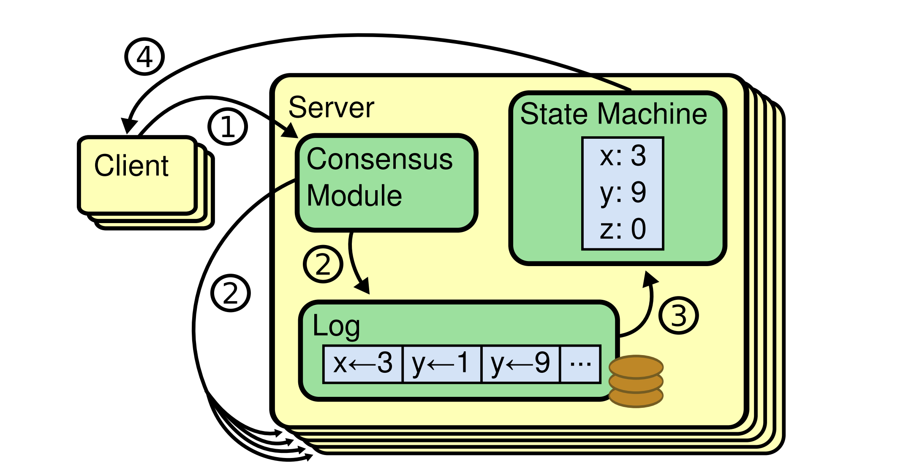
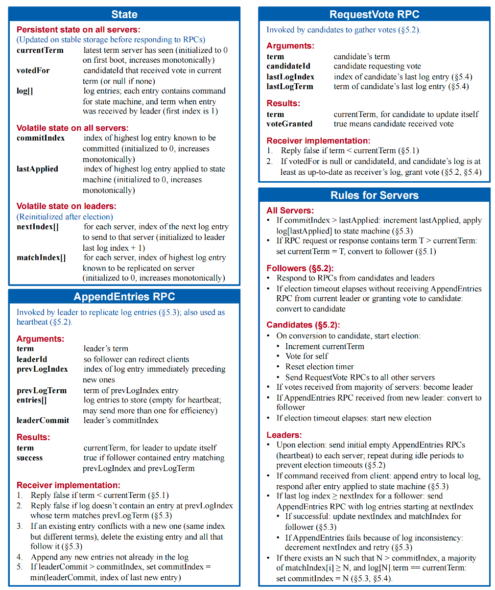
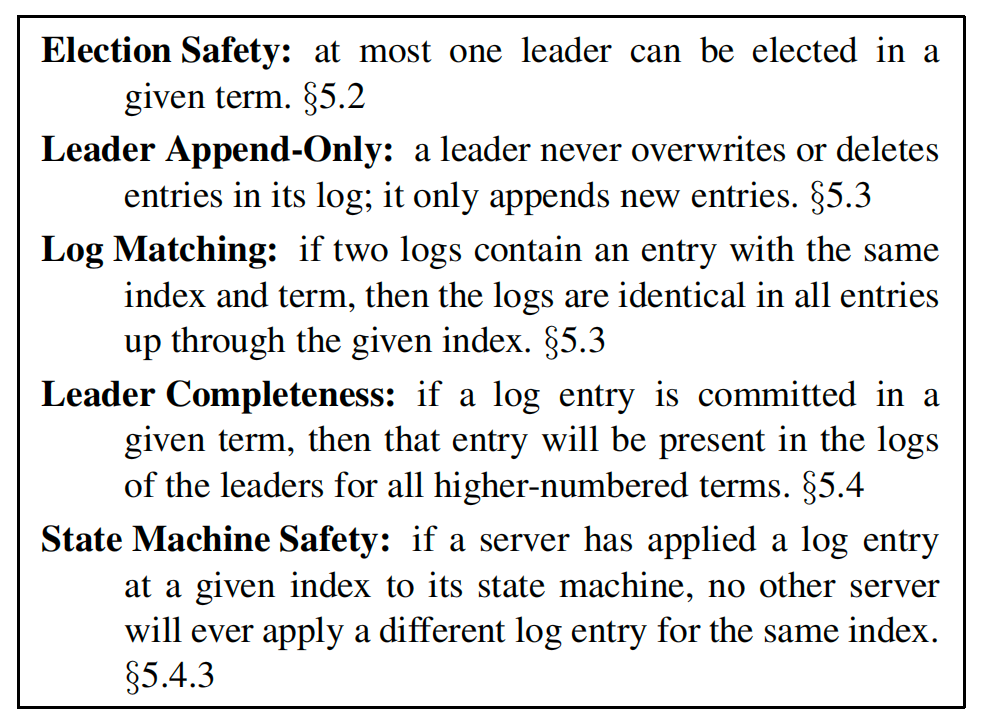

[论文-原件](raft.pdf)
---
因为 Paxos 算法太过于晦涩，而且在实际的实现上有太多的坑，并不太容易写对。所以，有人搞出了另外一个一致性的算法，叫 Raft。

<h1 align="center">寻找一种易于理解的一致性算法</h1>

Diego Ongaro and John Ousterhout Stanford University

## 摘要
Raft 是一种用于管理复制日志的共识算法。它的结果与（多实例）Paxos 等价，效率也与 Paxos 相当，但其结构与 Paxos 不同；这种差异使得 Raft 比 Paxos 更易于理解，同时也为构建实际系统提供了更好的基础。为了增强可理解性，Raft 将共识的关键要素——如领导者选举、日志复制和安全性——进行了分离，并通过强制实施更强的一致性，减少了需要考虑的状态数量。一项用户研究的结果表明，学生学习 Raft 比学习 Paxos 更容易。Raft还包含一种新的集群成员变更机制，该机制通过使用重叠多数（overlapping majorities）来保证安全性。

## 1. 引言
共识算法使得一组机器能够作为一个协调一致的群体协同工作，并能够容忍其中部分成员的故障。正因如此，它们在构建可靠的大型软件系统中扮演着关键角色。在过去十年中，Paxos \[[15](#anchor-15), [16](#anchor-16)] 一直主导着共识算法的讨论：大多数共识算法的实现都基于 Paxos 或受其影响，Paxos 也成为了向学生讲授共识知识的主要载体。

然而，尽管有许多尝试使其更易于理解，Paxos 本身仍然非常难以掌握。此外，它的架构需要进行复杂的修改才能支持实际系统。因此，无论是系统构建者还是学生，都对 Paxos 感到困难重重。

在我们自己也经历了与 Paxos 的艰难斗争之后，我们决定寻找一种新的共识算法，以期为系统构建和教育提供更坚实的基础。我们的方法颇为不同：我们的首要目标是可理解性——我们能否为实际系统定义一种共识算法，并以一种比 Paxos 显著更容易学习的方式来描述它？此外，我们希望该算法能够帮助建立系统构建者所必需的直觉认知。重要的不仅仅是算法“能工作”，更要让人一眼就能明白“它为什么能工作”。

这项工作的成果是一种名为 Raft 的共识算法。在设计 Raft 时，我们应用了特定的技术来提升其可理解性，包括模块化分解（Raft 将领导者选举、日志复制和安全性分离开来）和状态空间缩减（与 Paxos 相比，Raft 减少了非确定性的程度，以及服务器之间可能不一致的方式）。一项在两所大学针对 43 名学生开展的用户研究表明，Raft 显著比 Paxos 更容易理解：在学习了两种算法之后，其中 33 名学生回答关于 Raft 的问题表现优于回答关于 Paxos 的问题。

Raft 在许多方面与现有的共识算法相似（最著名的是 Oki 和 Liskov 提出的 Viewstamped Replication \[[29](#anchor-29), [22](#anchor-22)]），但它也包含了几项创新特性：

* 强领导者（Strong Leader）：Raft 采用了一种比其他共识算法更强的领导形式。例如，日志条目只能从领导者流向其他服务器。这简化了复制日志的管理，也使 Raft 更易于理解。

* 领导者选举（Leader Election）：Raft 使用随机化定时器来选举领导者。这种方法只需在任何共识算法都必需的心跳机制上增加极少的复杂性，却能简单而快速地解决选举冲突。
* 成员变更（Membership Changes）：Raft 改变集群服务器集合的机制采用了一种新的联合共识（joint consensus） 方法，在配置转换期间，两个不同配置的多数派会重叠。这使得集群在配置变更过程中仍能正常运行。

--- 校验--
## 2. 复制状态机
一致性算法通常应用在「复制状态机」(*replicated state machines*)上下文环境中[37](#anchor-37)。状态机在服务集群中可以计算同一状态的相同副本，即使一些服务发生宕机依然能够继续工作。复制状态机被用来解决分布式系统中的容错问题。例如像[GFS](#anchor-8),[HDFS](#anchor-38),[RAMCloud](#anchor-33)等大规模系统，通常用一个单独的状态复制机来负责leader选举和保存配置信息，来保证领导者崩溃时该副本仍能存活。使用复制状态机的例子包括[Chubby](#anchor-2)和[ZooKeeper](#anchor-11).

<a id="raft-1"> **图-1:**</a>复制状态机架构。「共识算法」会处理客户端发送的包含状态机指令的复制日志。状态机会根据日志中相同的命令顺序来处理，所以能保证相同的输出。

如图1所示，复制状态机是使用复制日志来实现的。每一台服务器都存储有状态机执行的一系列有序的命令日志。每一份日志都包含相同顺序的相同命令，所以每一台状态机会按照相同的顺序处理命令。因为状态机的顺序确定，所以计算的状态也是确定的，从而输出的也是相同的顺序。

保证复制日志的一致性，是「共识算法」的工作。服务中的一致性模型会接收来自客户端的命令并将它们添加到日志中。即使在一些服务器发生故障，它也会同步给其它服务中的一致性模型来保证每个服务中的日志中都包含有相同顺序的相同请求。一旦命令被正确的复制，每个服务的状态机将会按照日志的顺序来处理它们，然后将输出结果返回给客户端。最终，一个单一、高可用的状态机就完成了。
一个用于实际项目中的「共识算法」通常包括以下属性：
* 在非拜占庭（故障）条件下，保证***安全性（safety）***（不会返回不正确的结果），包括网络延时，区分割、丢包，重复和乱序。
* 只要大多数服务器仍在运行，并且彼此之间以及与客户端之间能够相互通信，系统就完全正常工作（***可用（available）***）。另外，一个典型的包含5台服务的集群可以容忍任意两台服务器失效。服务器如果停止服务；它们会根据状态存储中的状态恢复然后重新加入到集群。
* 「共识算法」不依赖时序来保证日志的一致性：时钟故障和极端消息延迟，最坏情况下只会导致可用性问题。
* 正常情况下，只要集群中的大多数节点完成一轮调用结果确认，这条命令便成功执行完成了。少数慢的服务器不会影响到整个集群的性能。

## 3. Paxos 有什么问题？
在过去的10年里，Leslie Lamport 的 Paxos 协议 [[15]](#anchor-15)几乎成为了共识领域的代名词：它是课程中最经常被教授的协议，而且大多数「共识算法」的实现都以它作为起点的。Paxos首先定义了单个决策共识协议，例如单一一条复制日志条目，我们将这一子条目称为**单决议Paxos**（single-decree Paxos）;接着，Paxos将多个单决议实例组合起来，用来实现一系列的决策，例如日志序列（记录多个状态变更），这种扩展称为**多决议Paxos**（multi-Paxos）。Paxos 既能保证安全性，又可以保证活性，并且支持集群中的成员变更。它的正确性已经验证过，且通常情况下是高效的。
然而，Paxos有两个致命的缺点。第一个缺点是Paxos非常难以理解。其完整释义[15](#anchor-15)以晦涩难懂而闻名；极少有人能成功的读懂它，且需要付出极大的努力才能弄懂。因此，出现了很多尝试以一种简单的方式来解释Paxos\[[16](#anchor-16), [20](#anchor-20), [21](#anchor-21)]。这些解释的焦点都集中在了单决议这个子集上，但即使这样，想要理解它们仍然具有很大的挑战。在NSDI 2012会议参与者中的一项非正式调查中，我们发现即使是在经验丰富的研究人员中也很少有人对Paxos感到得心应手。我们自己也在为Paxos而苦恼；我们很难理解整个协议知道我们阅读了几篇简要的解释，并且设计出我们自己的替代性协议后，这些工作足足耗费了我们将近一年的时间。
我们姑且认为Paxos的晦涩难懂基于它选择建立在**单决议**（single-decree）子集之上。单决议Paxos难懂且微妙：它分成两个阶段，这两个阶段没有简单直观的解释并且无法独立来理解。因此，人们很难理解单决议协议的工作原理。多决议Paxos的组成规则又在此基础上增加了晦涩难懂的程度。我们认为在多版本共识（即：一个日志而不是单个条目）上的的问题，可以分解为其它更直接和更易理解的方式。

Paxos的第二个问题是它并没有为实际构建提供一个良好的基础。一个原因是对于**多决议Paxos**它并没有提供一个被广泛认可的算法。Lamport(*莱斯利·兰伯特-Leslie Lamport*)的描述主要集中在单决议Paxos上，但是很多细节的东西都被忽略了。诚然Paxos有很多补充和优化，例如\[[26](#anchor-26)],\[[39](#anchor-39)]和\[[13](#anchor-13)],但它们彼此之间也和Lamport的草图有出入。像Chubby\[[4](#anchor-4)]系统已经实现了类Paxos(Paxos-like)的算法，但是很多案例的详细细节并没有被公开。

此外，Paxos的架构并不适用于构建实际系统；这是将解决多决议构建在单决议分解上的另一种后果。例如，选择一系列独立的日志条目然后经他们拼接为一个日志序列的做法收效甚微。这只能是徒增复杂度。围绕日志设计来系统比如以新条目按特定顺序依次追加的方式将会更简单更高效。另一个问题是，Paxos在其核心设计中采用了一种对称的点对点的方式（尽管最终建议以一种弱化的领导者机制作为性能优化手段）。这在一个只有单一决定的简单世界中有意义，但是实际系统中很少有人会这么实现。如果必须做出一系列的决定，那么首先选举出一个领导者，然后再由领导者协调决策将是最简单和高效的。

因此，实际中的分布式系统实现和Paxos理论相去甚远。每个分布式系统都是从Paxos开始出发，然后发现实现中的困难，最后开发出与之截然不同的架构。这个过程既耗时又容易出错，而Paxos本身的晦涩难懂更是加剧了这一问题。Paxos的构想可能更适用于证明其正确性的定理，但其真正的实现和Paxos相差太大，以至于这些证明显得几乎毫无价值。下面这些来自Chubby实现者的评论就很能说明问题：

*Paxos 算法的描述与现实系统的需求之间存在巨大鸿沟……所以我们最终构建出的系统是基于一个未经证明过的协议之上的[[4]](#anchor-4)。*

基于此，我们可以得出无论是针对系统构建还是教材，Paxos都没有打下一个好的基础。鉴于共识算法在大型分布式系统中的重要性，我们决定探索一种比Paxos更优秀的替代性共识算法。**Raft**便是这次探索的结果。

## 4. 为「可理解性」而设计
以下是Raft的设计目标：它必须为系统构建提供一套完整且实用的基础，来减少开发者的设计工作量；它必须在所有条件下保证安全性，在典型条件下满足可用性；必须保证在常见操作下的高效性。但是我们最重要的目标，也是我们最大的挑战-**可理解性**。它必须让大多数受众轻松的理解这个算法。另外，它必须保证算法是条理清晰的，以便系统构建者在对真实场景实现中能够进行一些必要的扩展。

在Raft设计过程中，我们必须在多种可选方案中做出决策。在这种情况下我们评估可选方案的指标就是基于**可理解性**：阐述清晰这些方案有多少难度（例如：它的状态空间的复杂度，是否包含不易察觉的其它含义），对于读者来时是否能很容易的理解它的方案和含义？

我们察觉到这种分析具有很高的主观性；尽管如此，我们使用了两种普遍使用的技巧。第一个技巧便是众所周知的问题分解法：只要可以，我们便把问题分解为多个可以独立解决、解释和理解的子问题。例如：在Raft中我们划分出了「领导者选举」，「日志复制」，「安全性」和「成员变更」。

第二个方法是通过精简可能涉及到的状态数量来简化状态空间，从而使得系统更加有条理性，并尽可能消除不确定性。另外，日志是不允许出现空洞的，Raft限制了日志之间产生不一致的可能。尽管在大多数场景中，我们会努力消除不确定性，但存在一些情况，不确定性反而能降低对系统的理解难度。一个典型的例子，随机性的方法引入了不确定性，但如果用同样的方式来处理所有可能性的选择问题上反而会缩小状态范围（“选择任意一个；对结果没有影响”）。所以我们使用随机法来简化领导者选举算法。

## 5. Raft 共识算法

从第二节的叙述中我们知道了Raft是管理复制日志的一个算法。[图2](#raft-2)简要的概述了这个算法以供参考，[图3](#raft-3)列举了该算法的关键属性；图中涉及到的部分我们会在本节分别进行讨论。

Raft通过先选举出一个特定的领导者来实现共识，然后让该领导者全权负责对复制日志的管理。领导者接收客户端发送的日志片段，
然后将其同步复制给其它服务器，并告知服务器何时可以安全的将这些日志片段应用到它们的状态机上。

<a id="raft-2"> **图-2:**</a>Raft共识算法简要总结（不包括成员变更和日志压缩）。左上角方框内将服务器行为描述为一组独立和反复触发结果的集合。在诸如 §5.2 小节会对这一特性做讨论。这里[31]是一份正式规范单独对这个算法做了更精确的讨论。

<a id="raft-2"> **图-2:**</a>Raft共识算法简要总结（不包括成员变更和日志压缩）。左上角方框内将服务器行为描述为一组独立和反复触发结果的集合。在诸如 §5.2 小节会对这一特性做讨论。这里[31]是一份正式规范单独对这个算法做了更精确的讨论。

---
## 引用文献
<a id="anchor-1">[1]</a> BOLOSKY, W. J., BRADSHAW, D., HAAGENS, R. B.,KUSTERS, N. P., AND LI, P. Paxos replicated state
machines as the basis of a high-performance data store.In Proc. NSDI’11, USENIX Conference on Networked Systems Design and Implementation (2011), USENIX,pp. 141–154.

<a id="anchor-2">[2]</a> BURROWS, M. The Chubby lock service for looselycoupled distributed systems. In Proc. OSDI’06, Symposium on Operating Systems Design and Implementation(2006), USENIX, pp. 335–350.

<a id="anchor-3">[3]</a> CAMARGOS, L. J., SCHMIDT, R. M., AND PEDONE, F.Multicoordinated Paxos. In Proc. PODC’07, ACM Symposium on Principles of Distributed Computing (2007),ACM, pp. 316–317.

<a id="anchor-4">[4]</a> CHANDRA, T. D., GRIESEMER, R., AND REDSTONE, J.Paxos made live: an engineering perspective. In Proc.PODC’07, ACM Symposium on Principles of Distributed Computing (2007), ACM, pp. 398–407.

<a id="anchor-5">[5]</a> CHANG, F., DEAN, J., GHEMAWAT, S., HSIEH, W. C.,WALLACH, D. A., BURROWS, M., CHANDRA, T.,
FIKES, A., AND GRUBER, R. E. Bigtable: a distributed storage system for structured data. In Proc. OSDI’06,USENIX Symposium on Operating Systems Design and Implementation (2006), USENIX, pp. 205–218.

<a id="anchor-6">[6]</a> CORBETT, J. C., DEAN, J., EPSTEIN, M., FIKES, A.,FROST, C., FURMAN, J. J., GHEMAWAT, S., GUBAREV,
A., HEISER, C., HOCHSCHILD, P., HSIEH, W., KANTHAK, S., KOGAN, E., LI, H., LLOYD, A., MELNIK,S., MWAURA, D., NAGLE, D., QUINLAN, S., RAO, R.,ROLIG, L., SAITO, Y., SZYMANIAK, M., TAYLOR, C.,WANG, R., AND WOODFORD, D. Spanner: Google’s globally-distributed database. In Proc. OSDI’12, USENIX Conference on Operating Systems Design and Implementation (2012), USENIX, pp. 251–264.

<a id="anchor-7">[7]</a> COUSINEAU, D., DOLIGEZ, D., LAMPORT, L., MERZ,
S., RICKETTS, D., AND VANZETTO, H. TLA+ proofs.
In Proc. FM’12, Symposium on Formal Methods (2012),
D. Giannakopoulou and D. M´ery, Eds., vol. 7436 of Lecture Notes in Computer Science, Springer, pp. 147–154.

<a id="anchor-8">[8]</a> GHEMAWAT, S., GOBIOFF, H., AND LEUNG, S.-T. The Google file system. In Proc. SOSP’03, ACM Symposium on Operating Systems Principles (2003), ACM, pp. 29–43.

<a id="anchor-9">[9]</a> GRAY, C., AND CHERITON, D. Leases: An efficient faulttolerant mechanism for distributed file cache consistency.In Proceedings of the 12th ACM Ssymposium on Operating Systems Principles (1989), pp. 202–210.
<a id="anchor-10">[10]</a> HERLIHY, M. P., AND WING, J. M. Linearizability: a correctness condition for concurrent objects. ACM Transactions on Programming Languages and Systems 12 (July 1990), 463–492.

<a id="anchor-11">[11]</a> HUNT, P., KONAR, M., JUNQUEIRA, F. P., AND REED,B. ZooKeeper: wait-free coordination for internet-scale systems. In Proc ATC’10, USENIX Annual Technical Conference (2010), USENIX, pp. 145–158.

<a id="anchor-12">[12]</a> JUNQUEIRA, F. P., REED, B. C., AND SERAFINI, M.Zab: High-performance broadcast for primary-backup systems. In Proc. DSN’11, IEEE/IFIP Int’l Conf. on Dependable Systems & Networks (2011), IEEE Computer Society,pp. 245–256.

<a id="anchor-13">[13]</a> KIRSCH, J., AND AMIR, Y. Paxos for system builders.Tech. Rep. CNDS-2008-2, Johns Hopkins University,2008.

<a id="anchor-14">[14]</a> LAMPORT, L. Time, clocks, and the ordering of events in a distributed system. Commununications of the ACM 21, 7 (July 1978), 558–565.

<a id="anchor-15">[15]</a> LAMPORT, L. The part-time parliament. ACM Transactions on Computer Systems 16, 2 (May 1998), 133–169.

<a id="anchor-16">[16]</a> LAMPORT, L. Paxos made simple. ACM SIGACT News 32, 4 (Dec. 2001), 18–25.

<a id="anchor-17">[17]</a> LAMPORT, L. Specifying Systems, The TLA+ Language and Tools for Hardware and Software Engineers. AddisonWesley, 2002.

<a id="anchor-18">[18]</a> LAMPORT, L. Generalized consensus and Paxos. Tech.Rep. MSR-TR-2005-33, Microsoft Research, 2005.

<a id="anchor-19">[19]</a> LAMPORT, L. Fast paxos. Distributed Computing 19, 2 (2006), 79–103.

<a id="anchor-20">[20]</a> LAMPSON, B. W. How to build a highly available system using consensus. In Distributed Algorithms, O. Baboaglu and K. Marzullo, Eds. Springer-Verlag, 1996, pp. 1–17.

<a id="anchor-21">[21]</a> LAMPSON, B. W. The ABCD’s of Paxos. In Proc.PODC’01, ACM Symposium on Principles of Distributed
Computing (2001), ACM, pp. 13–13.

<a id="anchor-22">[22]</a> LISKOV, B., AND COWLING, J. Viewstamped replication revisited. Tech. Rep. MIT-CSAIL-TR-2012-021, MIT,July 2012.

<a id="anchor-23">[23]</a> LogCabin source code. http://github.com/logcabin/logcabin.

<a id="anchor-24">[24]</a> LORCH, J. R., ADYA, A., BOLOSKY, W. J., CHAIKEN,R., DOUCEUR, J. R., AND HOWELL, J. The SMART
way to migrate replicated stateful services. In Proc. EuroSys’06, ACM SIGOPS/EuroSys European Conference on Computer Systems (2006), ACM, pp. 103–115.

<a id="anchor-25">[25]</a> MAO, Y., JUNQUEIRA, F. P., AND MARZULLO, K.Mencius: building efficient replicated state machines for WANs. In Proc. OSDI’08, USENIX Conference on Operating Systems Design and Implementation (2008),USENIX, pp. 369–384.

<a id="anchor-26">[26]</a> MAZIERES ` , D. Paxos made practical. http://www.scs.stanford.edu/˜dm/home/papers/paxos.pdf, Jan. 2007.

<a id="anchor-27">[27]</a> MORARU, I., ANDERSEN, D. G., AND KAMINSKY, M.There is more consensus in egalitarian parliaments. In Proc. SOSP’13, ACM Symposium on Operating System Principles (2013), ACM.

<a id="anchor-28">[28]</a> Raft user study. http://ramcloud.stanford.edu/˜ongaro/userstudy/.

<a id="anchor-29">[29]</a> OKI, B. M., AND LISKOV, B. H. Viewstamped replication: A new primary copy method to support
highly-available distributed systems. In Proc. PODC’88,ACM Symposium on Principles of Distributed Computing (1988), ACM, pp. 8–17.

<a id="anchor-30">[30]</a> O’NEIL, P., CHENG, E., GAWLICK, D., AND ONEIL, E.The log-structured merge-tree (LSM-tree). Acta Informatica 33, 4 (1996), 351–385.

<a id="anchor-31">[31]</a> ONGARO, D. Consensus: Bridging Theory and Practice.PhD thesis, Stanford University, 2014 (work in progress).http://ramcloud.stanford.edu/˜ongaro/thesis.pdf.

<a id="anchor-32">[32]</a> ONGARO, D., AND OUSTERHOUT, J. In search of an understandable consensus algorithm. In Proc ATC’14,USENIX Annual Technical Conference (2014), USENIX.

<a id="anchor-33">[33]</a> OUSTERHOUT, J., AGRAWAL, P., ERICKSON, D.,KOZYRAKIS, C., LEVERICH, J., MAZIERES ` , D., MITRA, S., NARAYANAN, A., ONGARO, D., PARULKAR,G., ROSENBLUM, M., RUMBLE, S. M., STRATMANN,E., AND STUTSMAN, R. The case for RAMCloud. Communications of the ACM 54 (July 2011), 121–130.

<a id="anchor-34">[34]</a> Raft consensus algorithm website.http://raftconsensus.github.io.

<a id="anchor-35">[35]</a> REED, B. Personal communications, May 17, 2013.

<a id="anchor-36">[36]</a> ROSENBLUM, M., AND OUSTERHOUT, J. K. The design and implementation of a log-structured file system. ACM Trans. Comput. Syst. 10 (February 1992), 26–52.

<a id="anchor-37">[37]</a> SCHNEIDER, F. B. Implementing fault-tolerant services using the state machine approach: a tutorial. ACM Computing Surveys 22, 4 (Dec. 1990), 299–319.

<a id="anchor-38">[38]</a> SHVACHKO, K., KUANG, H., RADIA, S., AND CHANSLER, R. The Hadoop distributed file system.
In Proc. MSST’10, Symposium on Mass Storage Systems and Technologies (2010), IEEE Computer Society, pp. 1–10.
<a id="anchor-39">[39]</a> VAN RENESSE, R. Paxos made moderately complex. Tech. rep., Cornell University, 2012.

