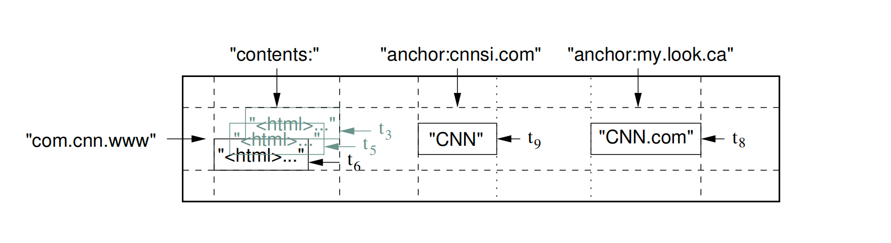
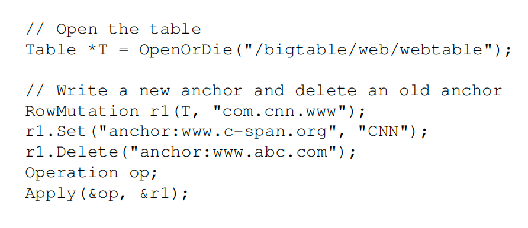
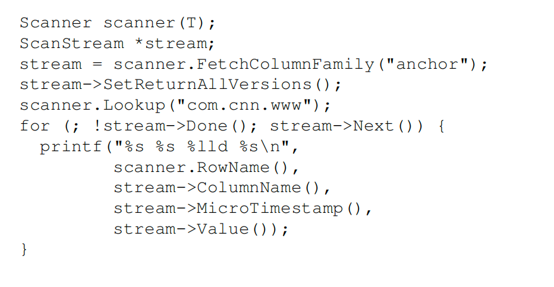
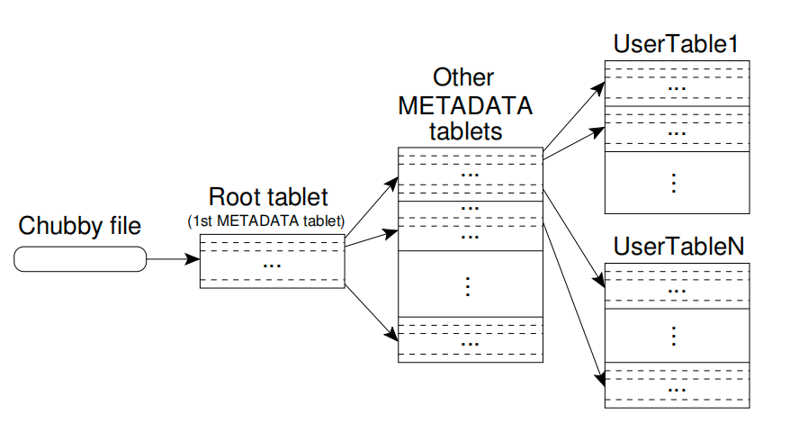
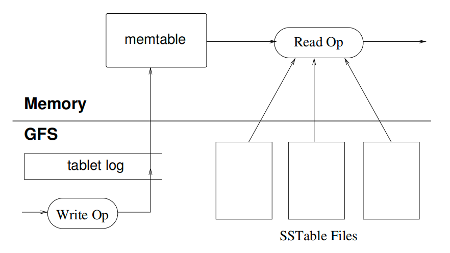
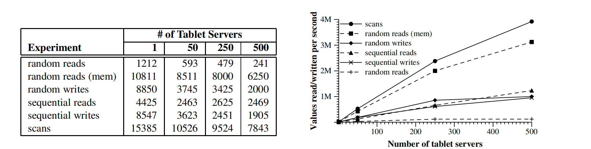
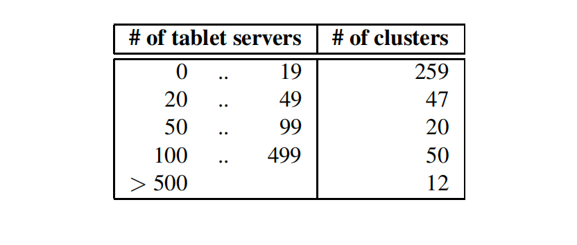
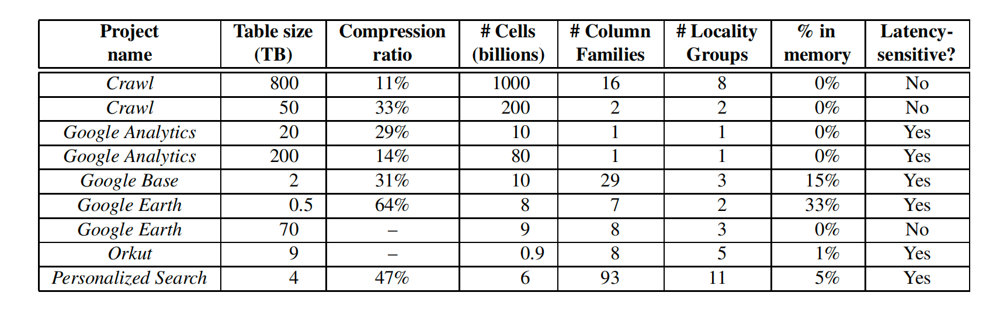

[论文-原件](bigtable-osdi06.pdf)
---

<h1 align="center">Bigtable: 结构化数据分布式存储系统</h1>

Fay Chang, Jeffrey Dean, Sanjay Ghemawat, Wilson C. Hsieh, Deborah A. Wallach
Mike Burrows, Tushar Chandra, Andrew Fikes, Robert E. Gruber
{fay,jeff,sanjay,wilsonh,kerr,m3b,tushar,fikes,gruber}[@google.com](https://www.google.com)
Google, Inc.

<!--未校验 -->

## 摘要
Bigtable 是一个旨在扩展到大规模的用于管理结构化数据的分布式存储系统：横跨数千台服务器的PB级别的数据量。在谷歌，很多项目都把数据存储在了Bigtable中，包括搜索引擎（web indexing），谷歌地球（Google Earth），谷歌财经（Google Finance）。这些不同的应用都对Bigtable有着不同的场景要求，既体现在数据大小方面（从网址到网页再到卫星图像），也体现在延迟性要求方面（从后端批处理到实时数据服务）。不管再怎么多样化的需求，Bigtable都成功的对所有的谷歌产品提供了灵活、高性能的解决方案。在这篇论文中，我们叙述了Bigtable提供的简单数据模型，它是怎样让客户端动态的控制数据的分布和格式，以及Bigtable的设计与实现。

### 1. 引言
在过去的两年半中，我们设计、实现并部署了一个名为 Bigtable 的分布式存储系统，用于在 Google 管理结构化数据。Bigtable 旨在可靠地扩展至 PB 级数据和数千台服务器。Bigtable 实现了多个目标：广泛的适用性、可扩展性、高性能以及高可用性。目前，超过六十个 Google 产品和项目使用 Bigtable，包括 Google Analytics（谷歌分析）、Google Finance（谷歌财经）、Orkut、个性化搜索（Personalized Search）、Writely（即后来的 Google Docs）以及 Google Earth（谷歌地球）。这些产品将 Bigtable 用于各种高要求的工作负载，范围从面向吞吐量的批处理任务，到对延迟敏感的、面向最终用户的数据服务。这些产品所使用的 Bigtable 集群配置差异很大，从几台服务器到数千台服务器不等，存储的数据量最多可达数百 TB。

在许多方面，Bigtable 与传统数据库相似：它与许多数据库系统共享了不少实现策略。并行数据库 [14] 和内存数据库 [13] 也实现了可扩展性和高性能，但 Bigtable 提供的接口与这些系统不同。Bigtable 并不支持完整的关係型数据模型；相反，它为客户提供了一个简单的数据模型，该模型支持对数据布局和格式的动态控制，并允许客户根据底层存储中数据的局部性特性进行优化设计。

数据通过任意字符串作为行名和列名进行索引。Bigtable 将数据视为未解释的字符串（uninterpreted strings），尽管客户通常会将各种结构化或半结构化数据序列化为这些字符串。客户可以通过在模式（schema）设计上的精心选择，来控制其数据的局部性。最后，Bigtable 的模式参数允许客户动态控制数据是从内存中提供服务，还是从磁盘读取。

第 2 节 更详细地描述了 Bigtable 的数据模型，第 3 节 概述了客户端 API。第 4 节 简要介绍了 Bigtable 所依赖的底层 Google 基础设施。第 5 节 描述了 Bigtable 实现的基本原理，第 6 节 介绍了一些我们为提升 Bigtable 性能所做的优化改进。第 7 节 提供了 Bigtable 性能的实测数据。我们在 第 8 节 给出了 Bigtable 在 Google 内部使用的若干实例，第 9 节 讨论了我们在设计和维护 Bigtable 过程中所获得的经验教训。最后，第 10 节 描述了相关工作，第 11 节 给出了我们的结论。

### 2. 数据模型
Bigtable 是一个稀疏的、分布式的、持久化的多维有序映射。该映射通过行键（row key）、列键（column key）和时间戳（timestamp）进行索引；映射中的每个值都是一个未解释的字节数组。

(row:string, column:string, time:int64) → string

<a id="figure7-1"> **图-1.** </a>一个存储网页信息的示例表格的切片。行名称是一个URL地址倒叙字符串。*contents*列族包含的是页面内容，*anchor*这一列包含指向该页面的所有锚点。CNN的主页被《体育画报》和MY-look主页同时引用，因此该行包含*anchor:cnnsi.com*和*anchor:my.look.ca*的列名称。每个锚点单元格有一个版本；内容列有三个版本，他们对应时间戳分别为t3、t5和t6。

在考察了类似 Bigtable 系统的各种潜在用途之后，我们最终确定了这一数据模型。一个推动我们部分设计决策的具体例子是：假设我们希望保存一份大规模网页及其相关信息的副本，供许多不同的项目使用；我们称这个特定的表为 Webtable。在 Webtable 中，我们将使用 URL 作为行键，使用网页的各个方面作为列名，并将网页内容存储在 contents: 列下，同时记录内容被抓取时的时间戳。如图1所示。

#### 行
表格中的行键是任意字符串（当前最大可达 64KB，尽管对于我们大多数用户来说，典型的大小是 10 到 100 字节）。在单个行键下的数据读取或写入操作都是原子性的（无论该行中涉及多少不同的列进行读取或写入），这一设计决策使得客户端在处理对同一行并发更新时更容易推理系统的行为。

Bigtable 按行键的字典序维护数据。表的行范围是动态划分的，每个行范围称为一个 tablet，它是数据分布和负载均衡的基本单位。因此，对较短行范围的读取操作非常高效，通常只需要与少量机器通信。

客户端可以通过精心选择行键，利用这一特性来优化数据访问的局部性。例如，在 Webtable 中，为了将同一域名下的网页聚集在一起，我们通过反转 URL 中的主机名组件来组织行键。比如，我们会将 maps.google.com/index.html 的数据存储在键 com.google.maps/index.html 下。

将同一域名下的页面存储在相邻的行中，使得对主机和域名的某些分析操作更加高效。

#### 列族
列键被分组为若干集合，称为列族（column families），列族是访问控制的基本单位。存储在同一个列族中的所有数据通常具有相同的类型（我们会将同一列族内的数据一起进行压缩）。在向某个列族下的任意列键存储数据之前，必须先创建该列族；一旦列族被创建，就可以使用该族内的任意列键。

我们的设计意图是：一张表中的不同列族数量应保持较少（最多几百个），并且在系统运行期间列族很少发生变化。相比之下，一张表可以拥有无限数量的列。

列键的命名采用以下语法：family:qualifier（列族名:列限定符）。

列族名必须是可打印字符（即可见的、合法的字符串）；
列限定符（qualifier） 则可以是任意字符串。
在 Webtable 中，一个示例列族是 language，用于存储网页所使用的语言。我们在 language 列族中只使用一个列键，用来存储每个网页的语言标识（如 "en" 表示英语，"zh" 表示中文）。

另一个对该表有用的列族是 anchor；该列族中的每个列键代表一个单独的锚点（即反向链接），如图 1 所示。其中，列限定符 是引用该网页的站点名称，单元格内容 则是该链接的锚文本（即超链接的显示文字）。

访问控制，以及磁盘和内存使用量的统计，都是在列族级别上进行的。在我们的 Webtable 示例中，这种机制使我们能够管理多种不同类型的应用程序：

一些应用可以添加新的基础数据，
一些应用可以读取基础数据并创建衍生的列族，
还有一些应用则仅被允许查看现有数据（出于隐私考虑，甚至可能无法查看所有现有的列族）。

#### 时间戳
Bigtable 中的每个单元格可以包含同一数据的多个版本，这些版本通过时间戳进行索引。Bigtable 的时间戳是 64 位整数。它们可以由 Bigtable 自动分配，此时表示以微秒为单位的“真实时间”；也可以由客户端应用程序显式指定。需要避免冲突的应用程序必须自行生成唯一的时间戳。同一个单元格的不同版本按时间戳降序存储，以便最新版本可以被优先读取。

<a id="bigtable-2"> **图-2.** </a>`写Bigtable`

为了减轻版本化数据管理的负担，我们支持按列族设置的两个选项，用于指示 Bigtable 自动进行版本数据的垃圾回收。客户端可以指定仅保留某个单元格的最新 n 个版本，或者仅保留足够新的版本（例如，只保留最近七天内写入的值）。

在我们的 Webtable 示例中，我们将存储在 contents: 列中的已爬取页面的时间戳设置为这些页面版本实际被爬取的时间。上述垃圾回收机制使我们能够仅保留每个页面最新的三个版本。

### 3. API

Bigtable API 提供了用于创建和删除表及列族的函数，同时还提供了用于修改集群、表和列族元数据（例如访问控制权限）的函数。

客户端应用程序可以向 Bigtable 写入或删除数据，查询单个行中的值，或遍历表中部分数据。图 2 展示了使用 `RowMutation` 抽象来执行一系列更新的 C++ 代码（为保持示例简洁，省略了无关细节）。对 `Apply` 的调用会对 Webtable 执行一次原子性修改：即向 `www.cnn.com` 添加一个锚点，同时删除另一个锚点。

[图 3](#bigtable-3) 展示了使用 `Scanner` 抽象来遍历某一行中所有锚点的 C++ 代码。客户端可以遍历多个列族，并且扫描操作提供了多种机制来限制返回的行、列和时间戳范围。例如，我们可以将上述扫描限制为仅返回列名匹配正则表达式 `anchor:*.cnn.com` 的锚点，或仅返回时间戳在当前时间前 10 天以内的锚点。

<a id="bigtable-3"> **图-3.** </a>`从Bigtable读`

Bigtable 还支持其他一些功能，使用户能够以更复杂的方式操作数据。首先，Bigtable 支持**单行事务**，可用于对同一行键下的数据执行原子性的读取-修改-写入操作。目前，Bigtable 尚不支持跨行键的通用事务，但为客户端提供了跨行键批量写入的接口。其次，Bigtable 允许将单元格用作**整数计数器**，支持原子性地增减其值。最后，Bigtable 支持在服务器地址空间内执行客户端提供的脚本。这些脚本使用 Google 开发的一种用于数据处理的语言 **Sawzall [28](#anchor-28)** 编写。目前，基于 Sawzall 的 API 不允许客户端脚本将数据写回 Bigtable，但支持各种形式的数据转换、基于任意表达式的过滤，以及通过多种操作符进行数据汇总。

Bigtable 可以与 MapReduce \[[12](#anchor-12)] 配合使用，后者是 Google 开发的大规模并行计算框架。我们编写了一组封装组件，使得 Bigtable 既可以作为 MapReduce 作业的输入源，也可以作为输出目标。

### 4. 模块构建

Bigtable 建立在 Google 的多个其他基础设施之上。Bigtable 使用分布式 Google 文件系统（GFS）\[[17](#anchor-17)] 来存储日志和数据文件。一个 Bigtable 集群通常运行在一个共享的机器池中，该机器池还运行着多种其他分布式应用程序，并且 Bigtable 进程经常与其他应用程序的进程共享同一台机器。Bigtable 依赖于一个集群管理系统来调度任务、管理共享机器上的资源、处理机器故障以及监控机器状态。

Google 的 SSTable 文件格式被用于 Bigtable 内部存储数据。SSTable 提供了一个持久化、有序且不可变的从键到值的映射，其中键和值均为任意字节字符串。它提供了根据指定键查找对应值的操作，以及遍历指定键范围内所有键值对的功能。在内部，每个 SSTable 包含一系列数据块（通常每个块大小为 64KB，但可配置）。一个位于 SSTable 末尾的**块索引（block index）**用于定位这些数据块，当 SSTable 被打开时，该索引会被加载到内存中。一次查找操作通常只需一次磁盘寻址即可完成：首先，在内存中的索引中通过二分查找确定目标数据所在的块，然后从磁盘读取该数据块。此外，SSTable 可选择性地被完全映射到内存中，这使得查找和扫描操作可以在不访问磁盘的情况下完成，从而显著提升性能。

Bigtable 依赖于一个高可用且持久化的分布式锁服务——Chubby \[[8](#anchor-8)]。一个 Chubby 服务由五个活跃的副本组成，其中通过选举产生一个主副本（master）来主动处理请求。当多数副本正常运行并能够相互通信时，该服务即为可用状态。Chubby 使用 Paxos 算法 \[[9](#anchor-9), [23](#anchor-23)] 来确保在发生故障时各副本之间的一致性。Chubby 提供了一个包含目录和小文件的命名空间。每个目录或文件都可以用作锁，对文件的读写操作是原子的。Chubby 客户端库提供了对 Chubby 文件的一致性缓存功能。每个 Chubby 客户端都会与 Chubby 服务维持一个会话。如果客户端未能在租约过期时间内成功续订其会话租约，则该会话将失效。当客户端会话失效时，它将失去所有持有的锁以及打开的句柄。此外，Chubby 客户端还可以在 Chubby 的文件和目录上注册回调函数，以接收变更通知或会话过期通知。

Bigtable 将 Chubby 用于多种关键任务：确保任意时刻最多只有一个活跃的主服务器（master）；存储 Bigtable 数据的引导位置（参见第 5.1 节）；发现 Tablet 服务器、确认 Tablet 服务器的失效；存储 Bigtable 的模式信息（每个表的列族信息）；以及存储访问控制列表。如果 Chubby 长时间不可用，Bigtable 也将随之不可用。我们最近对跨越 11 个 Chubby 实例的 14 个 Bigtable 集群进行了测量。由于 Chubby 不可用（由 Chubby 故障或网络问题引起），导致部分 Bigtable 数据无法访问的服务器小时数占总服务器小时数的平均比例为 0.0047%。其中受 Chubby 不可用影响最严重的单个集群，该比例为 0.0326%。

### 5. 实现

Bigtable 的实现包含三个主要组件：一个链接到每个客户端的库、一个主服务器（master server）和多个 Tablet 服务器（tablet servers）。Tablet 服务器可以根据工作负载的变化，从集群中动态添加或移除。

主服务器负责将 Tablet 分配给 Tablet 服务器，检测 Tablet 服务器的加入与失效，平衡 Tablet 服务器之间的负载，以及在 GFS 中进行文件的垃圾回收。此外，它还处理模式变更，例如表和列族的创建。

每个 Tablet 服务器管理一组 Tablet（通常每个 Tablet 服务器管理几十到上千个 Tablet）。Tablet 服务器负责处理对其所加载的 Tablet 的读写请求，并负责拆分那些变得过大的 Tablet。

与许多单主节点分布式存储系统 \[[17](#anchor-17), [21](#anchor-21)] 类似，客户端数据并不经过主服务器：客户端直接与 Tablet 服务器通信以执行读写操作。由于 Bigtable 客户端不依赖主服务器获取 Tablet 位置信息，大多数客户端从不与主服务器通信。因此，主服务器在实际运行中负载较轻。

一个 Bigtable 集群存储多个表。每个表由一组 Tablet 组成，每个 Tablet 包含与某个行范围相关的所有数据。最初，每个表仅包含一个 Tablet。随着表的增长，它会自动拆分为多个 Tablet，默认每个 Tablet 大小约为 100–200 MB。

#### 5.1 Tablet 位置（路由信息）

我们使用一个类似于 B+ 树 、\[[10](#anchor-10)] 的三级层次结构来存储 Tablet 位置信息（如[图 4](#bigtable-4) 所示）。

<a id="bigtable-4"> **图-4.** </a>`表层次结构`

第一级是一个存储在 Chubby 中的文件，其中包含根 Tablet 的位置信息。根 Tablet 包含一个特殊 METADATA 表中所有 Tablet 的位置信息。每个 METADATA Tablet 包含一组用户 Tablet 的位置信息。根 Tablet 就是 METADATA 表中的第一个 Tablet，但它被特殊对待——它永远不会被拆分，以确保 Tablet 位置的层次结构最多只有三级。

METADATA 表将一个 Tablet 的位置信息存储在一个行键下，该行键是该 Tablet 所属表的标识符（table identifier）及其结束行（end row）的编码。每个 METADATA 行在内存中大约存储 1KB 的数据。在 METADATA Tablet 大小为 128MB 的适中限制下，我们的三级寻址方案足以定位 $2^{34}$ 个 Tablet（或在 128MB 的 Tablet 情况下，总共 $2^{61}$ 字节的数据）。

客户端库会缓存 Tablet 的位置信息。如果客户端不知道某个 Tablet 的位置，或者发现其缓存的位置信息已失效，则会递归地向上遍历 Tablet 位置层次结构进行查找。如果客户端的缓存为空，定位过程需要 三次网络往返（round-trips），其中包括一次从 Chubby 读取根 Tablet 位置的操作。如果客户端的缓存过期，则最多可能需要六次网络往返，因为过期的缓存条目只有在访问失败时才会被发现（假设 METADATA Tablet 不频繁迁移）。尽管 Tablet 位置信息存储在内存中，无需访问 GFS，但我们进一步优化了这一开销：客户端库会预取（prefetch）Tablet 位置信息——即每次读取 METADATA 表时，会一并读取多个 Tablet 的元数据，从而减少后续查找的延迟。

此外，我们还在 METADATA 表中存储了一些辅助信息，包括每个 Tablet 相关的所有事件日志（例如某台服务器何时开始为该 Tablet 提供服务）。这些信息对于调试和性能分析非常有帮助。

#### 5.2 Tablet 分配

每个 Tablet 在任意时刻都只分配给一个 Tablet 服务器。主服务器（master）会持续跟踪当前所有活跃的 Tablet 服务器，以及各个 Tablet 到 Tablet 服务器的分配情况，包括哪些 Tablet 尚未分配。当某个 Tablet 处于未分配状态，并且存在一个有足够空间容纳该 Tablet 的 Tablet 服务器时，主服务器会通过向该 Tablet 服务器发送一个加载请求，将该 Tablet 分配给它。

Bigtable 使用 Chubby 来跟踪 Tablet 服务器的状态。当一个 Tablet 服务器启动时，它会在一个特定的 Chubby 目录中创建一个具有唯一名称的文件，并对该文件获取独占锁。主服务器（master）通过监控这个目录（即“servers 目录”）来发现可用的 Tablet 服务器。

如果某个 Tablet 服务器失去了对该文件的独占锁（例如，由于网络分区导致该服务器丢失了与 Chubby 的会话），它将停止为其管理的 Tablet 提供服务。（Chubby 提供了一种高效的机制，使 Tablet 服务器无需产生网络通信即可检查自己是否仍持有锁。）只要该文件仍然存在，Tablet 服务器就会持续尝试重新获取该文件上的独占锁。如果该文件已被删除，则该 Tablet 服务器将永远无法恢复服务，因此它会自行终止。每当 Tablet 服务器正常终止时（例如，由于集群管理系统将其所在的机器从集群中移除），它会主动尝试释放其持有的锁，以便主服务器能够更快地将其负责的 Tablet 重新分配给其他服务器。

主服务器（master）负责检测何时一个 Tablet 服务器已不再为其 Tablet 提供服务，并尽快重新分配这些 Tablet。为了检测 Tablet 服务器是否已停止服务，主服务器会定期向每个 Tablet 服务器查询其锁的状态。如果某个 Tablet 服务器报告它已失去其在 Chubby 上的独占锁，或者主服务器在最近几次尝试中都无法联系到该服务器，主服务器便会尝试获取该服务器对应 Chubby 文件上的独占锁。

如果主服务器成功获取了该文件的锁，说明 Chubby 本身是正常运行的，而该 Tablet 服务器已经宕机或与 Chubby 失去连接。此时，主服务器会通过删除该服务器的 Chubby 文件，确保该 Tablet 服务器再也无法恢复服务。一旦该服务器的文件被删除，主服务器就可以将之前分配给该服务器的所有 Tablet 移入“未分配 Tablet”集合中，随后将它们分配给其他正常的 Tablet 服务器。

为了确保 Bigtable 集群不会因主服务器与 Chubby 之间的网络问题而出现状态不一致，一旦主服务器自身的 Chubby 会话失效，它会立即自杀（自我终止）。然而，如前所述，主服务器的故障不会影响当前 Tablet 到 Tablet 服务器的分配关系——即数据服务仍可继续，客户端仍能正常读写。

当主服务器（master）由集群管理系统启动时，它需要先发现当前的 Tablet 分配状态，然后才能对其进行修改。主服务器在启动时会执行以下步骤：

* 获取唯一主锁：主服务器首先在 Chubby 中获取一个唯一的“master 锁”，以防止同时存在多个主服务器实例运行（即避免“脑裂”）。
* 发现存活服务器：主服务器扫描 Chubby 中的 servers 目录，找出当前所有活跃的 Tablet 服务器。
* 查询已分配 Tablet：主服务器与每个存活的 Tablet 服务器通信，获取它们当前已加载并服务的 Tablet 列表。
* 扫描 METADATA 表：主服务器扫描 METADATA 表，以获取系统中所有 Tablet 的完整集合。在扫描过程中，如果发现某个 Tablet 尚未被分配给任何服务器，主服务器就将该 Tablet 加入“未分配 Tablet”集合中，使其成为可被分配的候选对象。

一个复杂之处是，对 METADATA 表的扫描必须等到 METADATA 的 Tablet 被分配之后才能进行。因此，在开始此扫描（第 4 步）之前，如果在第 3 步中没有发现根 Tablet 的分配信息，主服务器会将根 Tablet 添加到未分配 Tablet 集合中。这一操作确保了根 Tablet 会被分配。由于根 Tablet 包含了所有 METADATA Tablet 的名称，主服务器在成功扫描根 Tablet 后，就能获知所有的 METADATA Tablet。

现有 Tablet 的集合仅在以下情况发生变化：创建或删除表、两个已有的 Tablet 合并成一个更大的 Tablet，或者一个已有的 Tablet 拆分成两个更小的 Tablet。主服务器能够跟踪这些变化，因为除了最后一种情况（Tablet 拆分）外，其余操作均由主服务器发起。

Tablet 拆分被特殊处理，因为它是被 Tablet 服务器发起的。Tablet 服务器通过在 METADATA 表中记录新 Tablet 的信息来提交拆分操作。当拆分操作提交完成后，它会通知主服务器。

如果拆分通知丢失（无论是因为 Tablet 服务器还是主服务器发生故障），主服务器会在之后请求某个 Tablet 服务器加载已被拆分的 Tablet 时发现新的 Tablet。该 Tablet 服务器会向主服务器报告此次拆分，因为它在 METADATA 表中查到的 Tablet 条目所描述的范围，只是主服务器要求它加载的 Tablet 范围的一部分。

#### 5.3 Tablet 服务

一个 Tablet 的持久化状态存储在 GFS 中，如[图 5](#bigtable-5) 所示。更新操作会被提交到一个提交日志（commit log）中，该日志存储重做记录（redo records）。这些更新中，最近已提交的部分存储在内存中的一个称为 memtable 的有序缓冲区中；而较早的更新则存储在一系列 SSTable 中。

为了恢复一个 Tablet，Tablet 服务器会从 METADATA 表中读取其元数据。该元数据包含组成该 Tablet 的 SSTable 列表，以及一组重做点（redo points），这些重做点是指向可能包含该 Tablet 数据的提交日志的指针。服务器将 SSTable 的索引读入内存，并通过应用自重做点以来所有已提交的更新，来重建 memtable。

<a id="bigtable-5"> **图-5.** </a>`Tablet释义`

当一个写操作到达 Tablet 服务器时，服务器会检查该操作是否格式正确，并验证发送者是否有权限执行该修改。授权是通过读取 Chubby 文件中的允许写入者列表完成的（该操作几乎总是命中 Chubby 客户端缓存）。有效的修改操作会被写入提交日志（commit log），并采用**组提交（group commit）** 来提升大量小规模修改的吞吐量 [13, 16]。在写操作被成功提交后，其内容会被插入到 memtable 中。

当一个读操作到达 Tablet 服务器时，同样会检查其格式正确性和授权权限。有效的读操作会在 **SSTable 序列与 memtable 的合并视图** 上执行。由于 SSTable 和 memtable 都是按字典序排序的数据结构，因此可以高效地构建这个合并视图。

在 Tablet 进行分裂或合并的过程中，**新的读写操作仍可继续正常处理**。

#### 5.4 合并压缩

随着写操作的执行，memtable 的大小不断增加。当 memtable 的大小达到某个阈值时，该 memtable 会被冻结，同时创建一个新的 memtable，并将冻结的 memtable 转换为一个 SSTable 写入 GFS。这个**次要合并（minor compaction）**过程有两个目标：一是减少 Tablet 服务器的内存使用量，二是减少服务器发生故障时在恢复过程中需要从提交日志中读取的数据量。在合并压缩进行期间，新的读写操作仍可继续执行。

每次次要合并都会生成一个新的 SSTable。如果这种行为不受控制地持续下去，读操作可能需要合并来自任意多个 SSTable 的更新。为避免这种情况，我们通过在后台定期执行**合并式压缩（merging compaction）** 来限制此类文件的数量。合并式压缩会读取若干个 SSTable 和 memtable 的内容，并将其合并输出为一个新的 SSTable。一旦合并压缩完成，输入的 SSTable 和 memtable 就可以被丢弃。

将所有 SSTable 重新写入为**一个**SSTable 的合并压缩称为**主合并（major compaction）**。  
由非主合并压缩生成的 SSTable 可能包含特殊的删除项，用于屏蔽仍处于活跃状态的旧 SSTable 中已被删除的数据。  
而主合并压缩生成的 SSTable 则**不包含任何删除项或已删除的数据**。  

Bigtable 会遍历其所有的 Tablet，并定期对它们执行主合并。这些主合并使得 Bigtable 能够：
- 回收被已删除数据占用的存储资源；
- 确保已删除的数据能够及时从系统中彻底消失。

这对于存储敏感数据的服务而言尤为重要。

### 6. 优化

上一节描述的实现需要进行多项改进，才能达到用户所要求的高性能、高可用性和高可靠性。本节将更详细地介绍部分实现细节，以突出这些改进之处。

#### 局部性组

客户端可以将多个列族组合成一个局部性组（locality group）。每个 Tablet 中的每个局部性组都会生成一个独立的 SSTable。将通常不会被一起访问的列族分隔到不同的局部性组中，可以实现更高效的读取。例如，Webtable 中的页面元数据（如语言和校验和）可以放在一个局部性组中，而页面内容可以放在另一个组中：需要读取元数据的应用程序无需读取全部的页面内容。

此外，还可以针对每个局部性组指定一些有用的调优参数。例如，可以将一个局部性组声明为内存驻留型（in-memory）。内存型局部性组的 SSTable 会由 Tablet 服务器在需要时被惰性地加载到内存中。一旦加载完成，属于该类局部性组的列族就可以在无需访问磁盘的情况下被读取。此特性适用于频繁访问的小数据量场景：我们在内部就将该特性用于 METADATA 表中的 location 列族。

#### 数据压缩

客户端可以控制某个局部性组的 SSTable 是否进行压缩，以及使用哪种压缩格式。用户指定的压缩格式会应用于每个 SSTable 块（其大小可通过该局部性组的特定调优参数进行控制）。尽管通过单独压缩每个块会损失一些压缩空间，但其优势在于可以只读取 SSTable 的一小部分而无需解压整个文件。

许多客户端使用一种两阶段的自定义压缩方案：
- 第一阶段采用 Bentley 和 McIlroy 的方法 [6](#anchor-6)，能够在大窗口范围内压缩较长的公共字符串；
- 第二阶段使用一种快速压缩算法，用于查找数据中 16 KB 小窗口内的重复内容。

这两种压缩过程都非常快速：在现代机器上，编码速度可达 100–200 MB/s，解码速度可达 400–1000 MB/s。

尽管我们在选择压缩算法时更注重速度而非空间压缩率，但这种两阶段压缩方案的表现却出人意料地好。例如，在 Webtable 中，我们使用该压缩方案来存储网页内容。在一个实验中，我们将大量文档存储在一个压缩的局部性组中。为了实验目的，我们仅存储了每个文档的一个版本，而不是存储我们拥有的所有版本。该方案实现了 **10:1 的空间压缩比**。

这远优于 HTML 页面上典型的 Gzip 压缩（通常为 3:1 或 4:1），原因在于 Webtable 的行布局方式：来自同一主机的所有页面被存储在彼此靠近的位置。这使得 Bentley-McIlroy 算法能够识别出同一主机网页中存在的大量共享模板内容（如页眉、页脚、导航栏等）。

许多应用（不仅仅是 Webtable）在设计行键名称时，都会有意将相似的数据聚集在一起，从而实现非常高的压缩比。当我们在 Bigtable 中存储同一数据的多个版本时，压缩比还会进一步提升。

#### 提升读取性能的缓存

为了提升读取性能，Tablet 服务器使用两级缓存。**Scan Cache（扫描缓存）** 是一种高层级缓存，用于缓存 SSTable 接口返回给 Tablet 服务器代码的键值对。**Block Cache（块缓存）** 是一种低层级缓存，用于缓存从 GFS 读取的 SSTable 数据块。

Scan Cache 对那些倾向于重复读取相同数据的应用程序最为有用。而 Block Cache 则对那些倾向于读取与最近访问数据相近的数据的应用程序更有帮助（例如：顺序读取，或在热点行内对同一局部性组中的不同列进行随机读取）。

#### 布隆过滤器

如第 5.3 节所述，一次读操作必须读取构成 Tablet 状态的所有 SSTable。如果这些 SSTable 不在内存中，我们最终可能需要进行多次磁盘访问。为了减少访问次数，我们允许客户端为特定局部性组中的 SSTable 指定创建 **Bloom 过滤器（Bloom filters）** [7](#anchor-7)。Bloom 过滤器使我们能够判断某个 SSTable 是否可能包含指定行/列对的任何数据。

对于某些应用而言，仅使用少量 Tablet 服务器内存来存储 Bloom 过滤器，就能显著减少读取操作所需的磁盘寻道次数。我们在 Bigtable 中使用 Bloom 过滤器还意味着，大多数对不存在的行或列的查找操作无需访问磁盘即可完成。

#### 提交日志实现

如果我们将每个 Tablet 的提交日志保存在单独的日志文件中，那么会在 GFS 中同时写入大量文件。根据每个 GFS 服务器上底层文件系统的实现，这些写入操作可能导致大量的磁盘寻道，以写入不同的物理日志文件。此外，为每个 Tablet 使用单独的日志文件也会降低组提交优化的效果，因为这样形成的提交组往往会更小。为了解决这些问题，我们为每个 Tablet 服务器使用单个提交日志，将不同 Tablet 的修改操作混合追加到同一个物理日志文件中 \[[18](#anchor-18), [20](#anchor-20)]。

使用单个日志在正常操作期间带来了显著的性能优势，但却使恢复过程变得复杂。当一个 Tablet 服务器发生故障时，它所服务的 Tablet 会被分散迁移到大量其他 Tablet 服务器上：每台新服务器通常只加载原服务器的一小部分 Tablet。

为了恢复某个 Tablet 的状态，新的 Tablet 服务器需要从原服务器写入的提交日志中，重新应用该 Tablet 的所有修改操作。然而，这些不同 Tablet 的修改记录是混合存储在同一个物理日志文件中的。

一种做法是让每个新的 Tablet 服务器读取整个提交日志文件，并仅应用与其负责恢复的 Tablet 相关的日志条目。但是，按照这种方案，如果有 100 台机器各自被分配了一个来自故障服务器的 Tablet，那么该日志文件将被重复读取 100 次（每台服务器各读一次），造成严重的 I/O 浪费和恢复延迟。

我们通过首先将提交日志条目按键 `<table, row name, log sequence number>` 的顺序进行排序，来避免重复读取日志。在排序后的输出中，特定 Tablet 的所有修改操作是连续存储的，因此可以通过一次磁盘寻道后接顺序读取的方式高效地读取。

为了并行化排序过程，我们将日志文件分割为 64 MB 的片段，并在不同的 Tablet 服务器上并行地对每个片段进行排序。该排序过程由主服务器（Master）协调管理，并在某个 Tablet 服务器表明需要从某个提交日志文件中恢复修改操作时触发。

将提交日志写入 GFS 有时会因各种原因导致性能波动（例如：参与写入的某个 GFS 服务器宕机，或通往特定三个 GFS 服务器的网络路径出现拥塞，或这些服务器负载过高）。为了防止 GFS 的延迟尖峰影响写入性能，每个 Tablet 服务器实际上维护了两个日志写入线程，各自写入独立的日志文件，但同一时间只有一个线程处于活跃状态。

当活跃日志文件的写入性能变差时，系统会切换到另一个线程，由新激活的日志写入线程继续写入提交日志队列中的修改操作。日志条目中包含序列号，以便在恢复过程中能够识别并忽略因日志切换而产生的重复条目。

#### Tablet 恢复加速

如果主服务器（master）将一个 tablet 从一台 tablet 服务器迁移到另一台，源 tablet 服务器会首先对该 tablet 执行一次次要合并（minor compaction）。这次合并通过减少 tablet 服务器提交日志中未合并的（即未持久化的）状态量，从而缩短恢复时间。完成此次合并后，该 tablet 服务器将停止对该 tablet 提供服务。在真正卸载该 tablet 之前，该服务器会再执行一次（通常非常快速的）次要合并，以清除在第一次次要合并执行期间新到达的、日志中剩余的任何未合并状态。第二次次要合并完成后，该 tablet 就可以在另一台 tablet 服务器上加载，而无需重放任何日志条目来进行恢复。

#### 利用不可变性

除了 SSTable 缓存之外，由于我们生成的所有 SSTable 都是不可变的，Bigtable 系统的许多其他部分也因此得以简化。例如，我们在读取 SSTable 时不需要对文件系统进行任何访问同步。因此，行级别的并发控制可以非常高效地实现。

唯一一个同时被读操作和写操作访问的可变数据结构是 memtable。为了减少读取 memtable 时的竞争，我们将每个 memtable 的行设置为写时复制（copy-on-write），从而允许读操作和写操作并行执行。

由于 SSTable 是不可变的，永久删除数据的问题就转化为对过时 SSTable 的垃圾回收。每个 tablet 的 SSTable 都在 METADATA 表中进行注册。主服务器（master）通过一种标记-清除（mark-and-sweep）的垃圾回收机制 [25](#anchor-25) 来删除过时的 SSTable，其中 METADATA 表包含了所有存活 SSTable 的根集合。

最后，SSTable 的不可变性使我们能够快速拆分 tablet。我们不需要为每个子 tablet 生成一套新的 SSTable，而是让子 tablet 与父 tablet 共享原有的 SSTable。

### 7. 性能评估

我们搭建了一个包含 N 个 Tablet 服务器的 Bigtable 集群，用于测量 Bigtable 在不同 N 值下的性能和可扩展性。这些 Tablet 服务器配置为使用 1 GB 内存，并写入一个由 1786 台机器组成的 GFS 集群，每台机器配备两个 400 GB 的 IDE 硬盘。

N 台客户端机器生成了用于这些测试的 Bigtable 负载。（我们使用与 Tablet 服务器相同数量的客户端，以确保客户端永远不会成为瓶颈。）每台客户端机器配备两个 2 GHz 的双核 Opteron 处理器，拥有足够的物理内存来容纳所有运行进程的工作集，并配备一个千兆以太网连接。

这些机器被组织成一个两层树状交换网络，网络根部的总带宽约为 100–200 Gbps。所有机器都位于同一数据中心内，因此任意两台机器之间的往返时间小于 1 毫秒。

Tablet 服务器和主服务器（master）、测试客户端以及 GFS 服务器都运行在同一组机器上。每台机器都运行了一个 GFS 服务器，其中一些机器还同时运行了 Tablet 服务器、客户端进程，或与实验同时进行的其他作业的进程。

R 表示测试中涉及的 Bigtable 行键的不同数量。选择 R 的值是为了使每个基准测试在每个 Tablet 服务器上读取或写入的数据量约为 1 GB。

<a id="bigtable-6"> **图-6.** </a>`每秒读取/写入的 1000 字节数据项数量。表格显示的是每个 Tablet 服务器的操作速率；图表显示的是总聚合速率。`

顺序写入基准测试使用了从 0 到 R−1 的行键名称。这个行键空间被划分为 10N 个大小相等的区间。这些区间由一个中央调度器分配给 N 个客户端，每当某个客户端完成处理之前分配给它的区间后，调度器就立即分配下一个可用的区间。这种动态分配方式有助于减轻因客户端机器上运行的其他进程所导致的性能波动影响。

我们在每个行键下写入一个字符串。每个字符串都是随机生成的，因此无法压缩。此外，不同行键下的字符串各不相同，因此也无法进行跨行压缩。

随机写入基准测试与此类似，唯一的区别是在写入前会先将行键对 R 取模（即进行哈希映射），从而在整个基准测试期间，写入负载能够大致均匀地分布在整个行键空间中。

扫描基准测试（scan benchmark）与顺序读取基准测试类似，但使用了 Bigtable API 提供的扫描功能，用于遍历某个行键范围内的所有值。使用扫描可以减少基准测试中执行的 RPC（远程过程调用）次数，因为单个 RPC 就能从 Tablet 服务器获取一个长序列的值。

内存随机读取基准测试（random reads (mem)）与普通随机读取基准测试类似，但存放测试数据的局部性组被标记为“内存驻留型”（in-memory），因此读取操作直接从 Tablet 服务器的内存中满足，而无需读取 GFS。仅针对此基准测试，我们将每个 Tablet 服务器上的数据量从 1 GB 减少到 100 MB，以确保其能够轻松容纳在 Tablet 服务器可用的内存中。

[图 6](#bigtable-6) 展示了在向 Bigtable 读取和写入 1000 字节值时，各项基准测试性能的两种视图。表格部分显示了每个 Tablet 服务器每秒执行的操作数，而图表部分则显示了每秒总的聚合操作数。

#### 单个 Tablet 服务器性能

让我们先考察仅有一个 Tablet 服务器时的性能表现。随机读取的速度比其他所有操作都要慢一个数量级甚至更多。每次随机读取都涉及通过网络从 GFS 向 Tablet 服务器传输一个 64 KB 的 SSTable 数据块，而其中仅使用了单个 1000 字节的值。

该 Tablet 服务器每秒执行约 1200 次读取操作，这相当于从 GFS 读取约 75 MB/s 的数据。这一数据传输速率足以使 Tablet 服务器的 CPU 达到饱和，原因在于我们的网络栈、SSTable 解析以及 Bigtable 代码本身带来的开销；同时，这一速率也几乎足以占满我们系统中所使用的网络链路带宽。

对于具有此类访问模式的大多数 Bigtable 应用，通常会将 SSTable 的块大小（block size）设置为更小的值（通常为 8KB），以减少不必要的数据传输。

相比之下，从内存中进行的随机读取要快得多，因为每次 1000 字节的读取都直接从 Tablet 服务器的本地内存中满足，无需从 GFS 获取一个大的 64 KB 数据块。

随机写入和顺序写入的性能优于随机读取，因为每个 Tablet 服务器会将所有传入的写操作追加到**同一个提交日志（commit log）**中，并通过**组提交（group commit）**机制高效地将这些写操作批量流式写入 GFS，从而大幅提升写入吞吐。

随机写入和顺序写入之间的性能没有显著差异；在这两种情况下，所有写入操作都会被记录在同一个提交日志中，因此 I/O 模式基本一致。

顺序读取的性能优于随机读取，因为从 GFS 获取的每一个 64 KB SSTable 数据块都会被存入**块缓存（block cache）**中，随后可用于服务接下来的 64 次读取请求（假设每次读取 1000 字节且访问连续），从而显著减少后续对 GFS 的重复读取。

扫描（Scan）操作甚至更快，因为 Tablet 服务器可以通过一次客户端 RPC 返回大量数据值，使得单次 RPC 的开销被**分摊到大量数据上**，大大降低了每次操作的平均开销。

#### 扫描

随着系统中 Tablet 服务器的数量从 1 个增加到 500 个，总吞吐量显著提升，增幅超过一百倍。例如，当 Tablet 服务器数量增加 500 倍时，内存中随机读取的性能提升了近 300 倍。出现这种现象的原因是：该基准测试的性能瓶颈在于单个 Tablet 服务器的 CPU。

<a id="table-1"> **表-1.** </a>`Bigtable集群中每台tablet服务的分布式编号`

然而，性能的提升并非线性增长。对于大多数基准测试而言，当 Tablet 服务器数量从 1 个增加到 50 个时，每个服务器的吞吐量会出现显著下降。这种下降是由多服务器配置下的负载不均衡引起的，通常是由于其他进程竞争 CPU 和网络资源所致。

我们的负载均衡算法试图解决这种不均衡问题，但由于以下两个主要原因，无法做到完美：
1. 为了减少 Tablet 迁移次数，系统对重新平衡进行了限速（在迁移过程中，Tablet 会短暂不可用，通常不到一秒）；
2. 基准测试产生的负载会随着测试的进行而动态变化。

随机读取基准测试表现出最差的可扩展性（服务器数量增加 500 倍，总吞吐量仅提升了约 100 倍）。这是因为（如前所述）每次读取 1000 字节的数据时，都需要通过网络传输一个完整的 64 KB 大小的数据块。这种传输方式会迅速占满我们网络中多个共享的 1 千兆比特链路，导致随着机器数量的增加，每台服务器的吞吐量显著下降。

### 8. 真实应用

截至 2006 年 8 月，Google 的各种机器集群中运行着 388 个非测试用的 Bigtable 集群，总共包含约 24,500 个 Tablet 服务器。表 1 展示了每个集群中 Tablet 服务器数量的大致分布情况。这些集群中的许多被用于开发目的，因此在相当长的时间内处于空闲状态。其中一组包含 14 个繁忙集群，共拥有 8069 个 Tablet 服务器，其总请求量超过每秒 120 万次，传入的 RPC 流量约为 741 MB/s，传出的 RPC 流量约为 16 GB/s。

[表 2](#table-2) 提供了一些当前正在使用的表的部分数据。一些表用于存储提供给用户的数据，而另一些则用于批处理任务；这些表在总大小、平均单元格大小、从内存中提供服务的数据百分比以及表模式的复杂性方面差异很大。在本节的其余部分，我们将简要介绍三个产品团队是如何使用 Bigtable 的。

Google Analytics（analytics.google.com）是一项帮助网站管理员分析其网站流量模式的服务。它提供聚合统计信息，例如每日独立访客数量和每个 URL 的每日页面浏览量，以及网站跟踪报告，例如在之前浏览过特定页面的用户中，最终完成购买的用户所占的百分比。

为了启用该服务，网站管理员需在其网页中嵌入一小段 JavaScript 程序。每当页面被访问时，该程序就会被触发执行，并将有关请求的各种信息记录到 Google Analytics 中，例如用户标识符以及所访问页面的相关信息。Google Analytics 对这些数据进行汇总后提供给网站管理员。

#### 8.1 谷歌分析

我们简要介绍 Google Analytics 使用的两张表。原始点击数据表（约 200 TB）为每个终端用户会话维护一行数据。行键是一个包含网站名称和会话创建时间的元组。这种模式确保了访问同一网站的会话在存储上是连续的，并按时间顺序排列。该表压缩后大小为原始数据的 14%。

汇总表（约 20 TB）包含针对每个网站的各类预定义汇总数据。该表由定期调度的 MapReduce 作业从原始点击数据表中生成。每个 MapReduce 作业从原始点击数据表中提取最近的会话数据。整个系统的吞吐量受限于 GFS 的吞吐能力。该表压缩后大小为原始数据的 29%。

#### 8.2 谷歌地球

Google 运营着一系列服务，通过基于网页的 Google 地图界面（maps.google.com）和 Google Earth（earth.google.com）定制客户端软件，为用户提供访问全球地表高分辨率卫星图像的功能。这些产品允许用户在地球表面进行导航：可以平移、查看以及在不同分辨率的卫星图像上进行标注。该系统使用一张表进行数据预处理，使用另一组不同的表来为客户端提供服务。

预处理流水线使用一张表来存储原始图像数据。在预处理过程中，图像数据会被清理并整合为最终的可服务数据。该表包含约 70 太字节（terabytes）的数据，因此数据从磁盘提供服务。由于图像本身已经经过高效压缩，因此禁用了 Bigtable 的压缩功能。

<a id="table-2"> **表-2.** </a>`一些生产环境中使用表的特征。表大小（压缩前测量）和单元格数量表示近似大小。对于已禁用压缩的表，未提供压缩比率。`

影像表中的每一行对应一个独立的地理区域。行名的设计确保了相邻的地理区域在存储上彼此靠近。该表包含一个列族，用于记录每个区域的数据来源。这个列族包含大量的列：本质上每张原始图像对应一列。由于每个区域仅由少数几张图像构建而成，因此该列族非常稀疏。

预处理流水线大量依赖在 Bigtable 上运行的 MapReduce 来转换数据。在整个系统中，某些 MapReduce 作业期间，每个 Tablet 服务器的数据处理速度超过 1 MB/秒。

服务系统使用一张表来索引存储在 GFS 中的数据。这张表相对较小（约 500 GB），但必须以低延迟支持每个数据中心每秒数万次的查询。因此，该表分布在数百个 Tablet 服务器上，并且包含驻留在内存中的列族。

#### 8.3个性化搜索

个性化搜索 (www.google.com/psearch ）是一项可选择加入的服务，用于记录用户在谷歌旗下多种产品（如网页搜索、图片和新闻等）中的查询和点击行为。用户可以浏览自己的搜索历史，重新访问过去的查询和点击记录，也可以根据其历史使用模式获取个性化的搜索结果。

个性化搜索将每个用户的数据存储在 Bigtable 中。每个用户拥有唯一的用户ID（userid），并以该用户ID作为行名分配一行。所有用户行为都存储在一张表中。每种类型的行为都有独立的列族（例如，有一个列族专门用于存储所有的网页查询）。每个数据项使用对应用户行为发生的时间作为其在 Bigtable 中的时间戳。个性化搜索通过在 Bigtable 上运行 MapReduce 来生成用户画像。这些用户画像被用于为用户提供实时的个性化搜索结果。

个性化搜索数据在多个 Bigtable 集群之间进行复制，以提高可用性，并减少因客户端地理位置距离较远而导致的延迟。个性化搜索团队最初在 Bigtable 之上构建了一个客户端侧的复制机制，以确保所有副本最终保持一致。当前系统则使用了内置在服务器端的复制子系统。

个性化搜索存储系统的设计允许其他团队在自己的列中添加新的用户级信息，目前该系统已被许多其他 Google 产品用于存储用户特定的配置选项和设置。多个团队共享同一张表，导致该表的列族数量异常庞大。为了更好地支持共享，我们在 Bigtable 中添加了一个简单的配额机制，用于限制任何特定客户端在共享表中的存储使用量；该机制为使用此系统存储用户信息的各个产品团队之间提供了一定程度的隔离。

### 9. 经验教训

在设计、实现、维护和支持 Bigtable 的过程中，我们获得了宝贵的经验，并学到了一些有趣的教训。

我们学到的一个经验是：大型分布式系统容易遭受多种类型的故障，而不仅仅是许多分布式协议中所假设的标准网络分区和“失效即停止”（fail-stop）类故障。例如，我们曾遇到由以下各种原因引起的问题：
- 内存和网络数据损坏
- 时钟严重偏移
- 机器挂起
- 长时间且不对称的网络分区
- 我们所依赖的其他系统中的缺陷（例如 Chubby）
- GFS 配额溢出
- 计划内和计划外的硬件维护

随着对这些问题经验的积累，我们通过修改各种协议来加以应对。例如，我们在 RPC 机制中增加了校验和（checksumming）功能。此外，我们也通过消除系统各部分之间相互做出的假设来解决某些问题。例如，我们不再假设某个特定的 Chubby 操作仅会返回一组固定错误中的某一个。

我们学到的另一个经验是：**在尚不明确新功能的实际用途之前，推迟添加新功能非常重要**。例如，我们最初计划在 API 中支持通用的事务处理。然而，由于当时没有迫切的应用需求，我们并未实现这一功能。

如今，随着大量真实应用在 Bigtable 上运行，我们得以深入分析它们的实际需求，结果发现大多数应用仅需要**单行事务**（single-row transactions）。尽管有用户请求支持分布式事务，但其中最重要的用途是用于维护**二级索引**（secondary indices）。针对这一具体需求，我们计划添加一种专用的机制来满足。

这种新机制虽然不如通用的分布式事务灵活，但会更加高效（尤其是对于跨越数百行甚至更多行的更新操作），并且能更好地与我们现有的**跨数据中心乐观复制**（optimistic cross-data-center replication）方案协同工作。

我们从支持 Bigtable 的实践中学到的一个经验是：**系统级监控（即对 Bigtable 本身以及使用 Bigtable 的客户端进程进行监控）至关重要**。

例如，我们扩展了 RPC 系统，使得对于一部分采样的 RPC 请求，系统会详细记录为该请求所执行的关键操作的跟踪信息。这一功能帮助我们检测并修复了许多问题，例如：
- Tablet 数据结构上的锁竞争
- 在向 GFS 提交 Bigtable 数据变更时的写入延迟
- 当 METADATA Tablet 不可用时对 METADATA 表的卡住访问

另一个有用的监控实例是：**每个 Bigtable 集群都在 Chubby 中进行注册**。这使我们能够：
- 定位所有集群
- 查明它们的规模
- 查看它们运行的软件版本
- 了解它们接收的流量情况
- 及时发现潜在问题，例如异常高的延迟等

这些监控手段极大地提升了系统的可观测性、可维护性和稳定性。

我们学到的最重要的一课是**简单设计的价值**。

考虑到我们系统的规模（约 10 万行非测试代码），以及代码会随着时间以不可预知的方式不断演化的事实，我们发现，**代码和设计的清晰性对代码的维护和调试具有极大的帮助**。

一个典型的例子是我们的 Tablet 服务器成员管理协议。我们最初的设计非常简单：主服务器（master）定期向 Tablet 服务器发放租约（lease），如果 Tablet 服务器的租约过期，它就会自行终止。不幸的是，这种协议在网络出现问题时会显著降低系统的可用性，并且对主服务器的恢复时间也极为敏感。

我们对该协议进行了多次重新设计，直到得到一个性能良好的版本。然而，最终的协议变得过于复杂，并且依赖于 Chubby 中一些其他应用很少使用的功能特性。结果我们发现，自己花费了大量时间在调试一些晦涩的边界情况上——这些情况不仅出现在 Bigtable 的代码中，也出现在 Chubby 的代码中。

最终，我们彻底放弃了这个复杂的协议，转而采用了一个全新的、更简单的协议，该协议仅依赖于 Chubby 中被广泛使用的核心功能。

这一经历深刻地告诉我们：**即使一个协议在理论上更“先进”或“高效”，但如果它过于复杂或依赖冷门特性，其带来的维护成本和稳定性风险往往会远超其收益。简单、清晰、基于成熟机制的设计，才是长期成功的基石**。

### 10. 相关工作

Boxwood 项目 [24](#anchor-24) 的一些组件在功能上与 Chubby、GFS 和 Bigtable 有所重叠，因为它提供了分布式共识、分布式锁、分布式数据块存储以及分布式 B 树存储等功能。然而，在功能重叠的每一个方面，Boxwood 的组件似乎都比相应的 Google 服务处于更低的抽象层次。Boxwood 的目标是为构建更高级别的服务（如文件系统或数据库）提供底层基础设施，而 Bigtable 的目标则是直接支持希望存储数据的客户端应用程序。

近年来，许多研究项目致力于解决在广域网（尤其是“互联网规模”下）提供分布式存储或更高层次服务的问题。这包括从 CAN \[[29](#anchor-29)]、Chord \[[32](#anchor-32)]、Tapestry \[[37](#anchor-37)] 和 Pastry \[[30](#anchor-30)] 等项目开始的分布式哈希表（DHT）相关研究。这些系统关注的问题在 Bigtable 中并不存在，例如带宽高度可变、参与者不可信、频繁的网络重配置等；而分布式控制和拜占庭容错并非 Bigtable 的设计目标。

就向应用开发者提供的分布式数据存储模型而言，我们认为，由分布式 B 树或分布式哈希表所提供的键值对模型过于局限。键值对是一种有用的构建模块，但不应当成为提供给开发者的唯一构建模块。我们所选择的模型比简单的键值对更为丰富，能够支持稀疏的半结构化数据。尽管如此，它仍然足够简单，可以高效地用扁平文件（flat-file）形式表示，并且具有足够的透明性（通过局部性组实现），使用户能够调整系统的某些关键行为。

一些数据库厂商已经开发出能够存储海量数据的并行数据库。例如，Oracle 的真实应用集群（Real Application Cluster）数据库 \[[27](#anchor-27)] 使用共享磁盘来存储数据（而 Bigtable 使用 GFS），并采用分布式锁管理器（Bigtable 使用 Chubby）。IBM 的 DB2 并行版 \[[4](#anchor-4)] 则基于“无共享”（shared-nothing）架构，与 Bigtable 类似。每个 DB2 服务器负责管理表中一部分行，并将其存储在本地的关系数据库中。这两款产品都提供了完整的**关系模型**和**事务支持**。

Bigtable 的局部性组（locality groups）实现了与那些在磁盘上采用**列式存储**而非行式存储的系统类似的压缩效果和磁盘读取性能优势，这些系统包括 C-Store \[[1](#anchor-1), [34](#anchor-34)] 以及商业产品如 Sybase IQ \[[15](#anchor-15), [36](#anchor-36)]、SenSage \[[31](#anchor-13)]、KDB+ \[[22](#anchor-22)]，以及 MonetDB/X100 中的 ColumnBM 存储层 \[[38](#anchor-38)]。另一个将数据在水平和垂直方向上分区并存储为扁平文件、同时实现良好压缩率的系统是 AT&T 的 Daytona 数据库 \[[19](#anchor-19)]。不过，局部性组并不支持 CPU 缓存级别的优化，例如 Ailamaki \[[2](#anchor-2)] 所描述的那些技术。

Bigtable 使用 memtable 和 SSTable 来存储对 Tablet 的更新，这种方式类似于**日志结构合并树**（Log-Structured Merge Tree）\[[26](#anchor-26)] 存储索引数据更新的方式。在这两种系统中，排序后的数据都会先在内存中进行缓存，然后再写入磁盘，并且读取操作必须合并来自内存和磁盘的数据。

### 11. 结论

我们描述了 Bigtable，这是 Google 用于存储结构化数据的一个分布式系统。Bigtable 集群自 2005 年 4 月起已投入生产使用，在此之前，我们大约花费了相当于七个人年的时间进行设计和实现。截至 2006 年 8 月，已有超过六十个项目在使用 Bigtable。我们的用户对 Bigtable 实现所提供的性能和高可用性表示满意，并且他们可以根据资源需求随时间的变化，通过简单地向系统中添加更多机器来扩展其集群的容量。

鉴于 Bigtable 拥有非传统的接口，一个值得思考的问题是：我们的用户在适应使用它时遇到了多大的困难？新用户有时会不确定如何最好地使用 Bigtable 的接口，特别是当他们习惯于使用支持通用事务的关系型数据库时。尽管如此，许多 Google 产品已成功使用 Bigtable 这一事实表明，我们的设计在实践中运行良好。

我们目前正在实现若干额外的 Bigtable 功能，例如对二级索引的支持，以及构建跨数据中心、具有多个主副本的复制型 Bigtable 的基础设施。此外，我们还开始将 Bigtable 作为一项服务提供给产品团队，使各个团队无需再自行维护各自的集群。随着我们的服务型集群不断扩展，我们将需要在 Bigtable 内部应对更多的资源共享问题 \[[3](#anchor-3), [5](#anchor-5)]。

最后，我们发现，在 Google 内部自主构建存储解决方案具有显著优势。通过为 Bigtable 自行设计数据模型，我们获得了极大的灵活性。此外，由于我们能够掌控 Bigtable 本身的实现，以及其所依赖的其他 Google 基础设施，因此一旦出现性能瓶颈或效率低下的问题，我们便可以及时消除它们。

### 致谢

我们感谢匿名评审人、David Nagle 以及我们的论文指导人 Brad Calder 对本文提供的反馈意见。Bigtable 系统从 Google 内部众多用户的反馈中获益良多。此外，我们还要感谢以下人员对 Bigtable 所做出的贡献：Dan Aguayo、Sameer Ajmani、Zhifeng Chen、Bill Coughran、Mike Epstein、Healfdene Goguen、Robert Griesemer、Jeremy Hylton、Josh Hyman、Alex Khesin、Joanna Kulik、Alberto Lerner、Sherry Listgarten、Mike Maloney、Eduardo Pinheiro、Kathy Polizzi、Frank Yellin 以及 Arthur Zwiegincew。

---
### 参考文献
[<a id="references1">1</a>] ABADI, D. J., MADDEN, S. R., AND FERREIRA,
M. C. Integrating compression and execution in columnoriented database systems. Proc. of SIGMOD (2006).

[<a id="references2">2</a>] AILAMAKI, A., DEWITT, D. J., HILL, M. D., AND SKOUNAKIS, M. Weaving relations for cache performance.In The VLDB Journal (2001), pp. 169–180.

[<a id="references3">3</a>] BANGA, G., DRUSCHEL, P., AND MOGUL, J. C. Resource containers: A new facility for resource management in server systems. In Proc. of the 3rd OSDI (Feb.
1999), pp. 45–58.

[<a id="references4">4</a>] BARU, C. K., FECTEAU, G., GOYAL, A., HSIAO,
H., JHINGRAN, A., PADMANABHAN, S., COPELAND,G. P., AND WILSON, W. G. DB2 parallel edition. IBM
Systems Journal 34, 2 (1995), 292–322.

[<a id="references5">5</a>] BAVIER, A., BOWMAN, M., CHUN, B., CULLER, D.,
KARLIN, S., PETERSON, L., ROSCOE, T., SPALINK, T.,AND WAWRZONIAK, M. Operating system support for
planetary-scale network services. In Proc. of the 1st NSDI(Mar. 2004), pp. 253–266.

[6] BENTLEY, J. L., AND MCILROY, M. D. Data compression using long common strings. In Data Compression Conference (1999), pp. 287–295.

[7] BLOOM, B. H. Space/time trade-offs in hash coding with allowable errors. CACM 13, 7 (1970), 422–426.

[8] BURROWS, M. The Chubby lock service for looselycoupled distributed systems. In Proc. of the 7th OSDI(Nov. 2006).

[9] CHANDRA, T., GRIESEMER, R., AND REDSTONE, J.Paxos made live — An engineering perspective. In Proc.of PODC (2007).

[10] COMER, D. Ubiquitous B-tree. Computing Surveys 11, 2(June 1979), 121–137.

[11] COPELAND, G. P., ALEXANDER, W., BOUGHTER,E. E., AND KELLER, T. W. Data placement in Bubba. In Proc. of SIGMOD (1988), pp. 99–108.

[12] DEAN, J., AND GHEMAWAT, S. MapReduce: Simplified data processing on large clusters. In Proc. of the 6th OSDI(Dec. 2004), pp. 137–150.

[13] DEWITT, D., KATZ, R., OLKEN, F., SHAPIRO, L.,
STONEBRAKER, M., AND WOOD, D. Implementation
techniques for main memory database systems. In Proc.
of SIGMOD (June 1984), pp. 1–8.

[14] DEWITT, D. J., AND GRAY, J. Parallel database systems: The future of high performance database systems.
CACM 35, 6 (June 1992), 85–98.

[15] FRENCH, C. D. One size fits all database architectures
do not work for DSS. In Proc. of SIGMOD (May 1995),
pp. 449–450.

[16] GAWLICK, D., AND KINKADE, D. Varieties of concurrency control in IMS/VS fast path. Database Engineering
Bulletin 8, 2 (1985), 3–10.

[17] GHEMAWAT, S., GOBIOFF, H., AND LEUNG, S.-T. The
Google file system. In Proc. of the 19th ACM SOSP (Dec.
2003), pp. 29–43.

[18] GRAY, J. Notes on database operating systems. In Operating Systems — An Advanced Course, vol. 60 of Lecture
Notes in Computer Science. Springer-Verlag, 1978.

[19] GREER, R. Daytona and the fourth-generation language
Cymbal. In Proc. of SIGMOD (1999), pp. 525–526.

[20] HAGMANN, R. Reimplementing the Cedar file system
using logging and group commit. In Proc. of the 11th
SOSP (Dec. 1987), pp. 155–162.

[21] HARTMAN, J. H., AND OUSTERHOUT, J. K. The Zebra
striped network file system. In Proc. of the 14th SOSP
(Asheville, NC, 1993), pp. 29–43.

[22] KX.COM. kx.com/products/database.php. Product page.

[23] LAMPORT, L. The part-time parliament. ACM TOCS 16,
2 (1998), 133–169.

[24] MACCORMICK, J., MURPHY, N., NAJORK, M.,
THEKKATH, C. A., AND ZHOU, L. Boxwood: Abstractions as the foundation for storage infrastructure. In Proc.
of the 6th OSDI (Dec. 2004), pp. 105–120.

[25] MCCARTHY, J. Recursive functions of symbolic expressions and their computation by machine. CACM 3, 4 (Apr.
1960), 184–195.

[26] O’NEIL, P., CHENG, E., GAWLICK, D., AND O’NEIL,
E. The log-structured merge-tree (LSM-tree). Acta Inf.
33, 4 (1996), 351–385.

[27] ORACLE.COM. www.oracle.com/technology/products/-database/clustering/index.html. Product page.

[28] PIKE, R., DORWARD, S., GRIESEMER, R., AND QUINLAN, S. Interpreting the data: Parallel analysis with Sawzall. Scientific Programming Journal 13, 4 (2005),227–298.

[29] RATNASAMY, S., FRANCIS, P., HANDLEY, M., KARP,R., AND SHENKER, S. A scalable content-addressable network. In Proc. of SIGCOMM (Aug. 2001), pp. 161–172.

[30] ROWSTRON, A., AND DRUSCHEL, P. Pastry: Scalable, distributed object location and routing for largescale peer-to-peer systems. In Proc. of Middleware 2001(Nov. 2001), pp. 329–350.

[31] SENSAGE.COM. sensage.com/products-sensage.htm.Product page.

[32] STOICA, I., MORRIS, R., KARGER, D., KAASHOEK,M. F., AND BALAKRISHNAN, H. Chord: A scalable
peer-to-peer lookup service for Internet applications. In Proc. of SIGCOMM (Aug. 2001), pp. 149–160.

[33] STONEBRAKER, M. The case for shared nothing.Database Engineering Bulletin 9, 1 (Mar. 1986), 4–9.

[34] STONEBRAKER, M., ABADI, D. J., BATKIN, A., CHEN,X., CHERNIACK, M., FERREIRA, M., LAU, E., LIN,
A., MADDEN, S., O’NEIL, E., O’NEIL, P., RASIN,A., TRAN, N., AND ZDONIK, S. C-Store: A columnoriented DBMS. In Proc. of VLDB (Aug. 2005), pp. 553–564.

[35] STONEBRAKER, M., AOKI, P. M., DEVINE, R.,LITWIN, W., AND OLSON, M. A. Mariposa: A new architecture for distributed data. In Proc. of the Tenth ICDE(1994), IEEE Computer Society, pp. 54–65.

[36] SYBASE.COM. www.sybase.com/products/databaseservers/sybaseiq. Product page.

[37] ZHAO, B. Y., KUBIATOWICZ, J., AND JOSEPH, A. D.Tapestry: An infrastructure for fault-tolerant wide-area location and routing. Tech. Rep. UCB/CSD-01-1141, CS Division, UC Berkeley, Apr. 2001.

[38] ZUKOWSKI, M., BONCZ, P. A., NES, N., AND HEMAN,S. MonetDB/X100 — A DBMS in the CPU cache. IEEE
Data Eng. Bull. 28, 2 (2005), 17–22.

